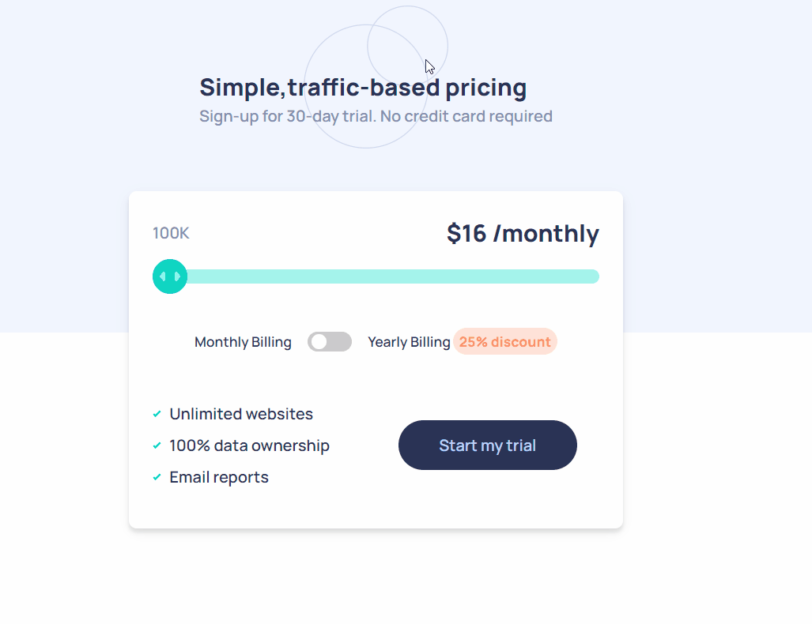

<h1 align="center">Card Interactive</h1>

<p align="center">
  <a href="#tech">Tech</a>&nbsp;&nbsp;&nbsp;|&nbsp;&nbsp;&nbsp;
  <a href="#project">Projeto</a>&nbsp;&nbsp;&nbsp;|&nbsp;&nbsp;&nbsp;
  <a href="#getting-started">Getting Started</a>
</p>


## Project 

Your users should be able to:


- View the optimal layout for the app depending on their device's screen size
- See hover states for all interactive elements on the page
- Use the slider and toggle to see prices for different page view numbers





Live Project: https://price-component-filipesaretta.vercel.app/ 

## Tech

- React
- Typescript
- Styled-components

## What I learn when I was building?

One of the things I learn was to manipulate the styles of the ```<input type="range"/>``` to make the way we needed to look using for example ```-webkit-appearance``` and ```::-webkit-slider-thumb```.


## Getting Started

Clone the project and access the folder.

```
git clone https://github.com/filipesaretta/price-component

cd price-component
```

Install the dependencies and start.

```
npm install

npm run dev
```


